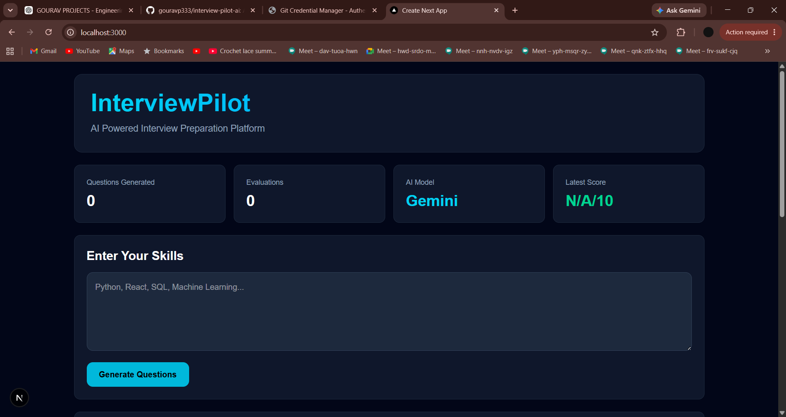
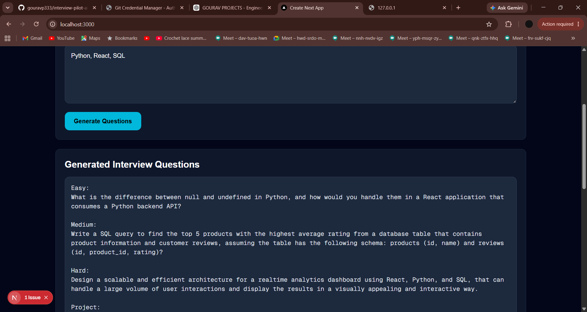

# InterviewPilot

AI-powered interview preparation platform built using Next.js, FastAPI, and Groq LLM.

## Features

* Generate personalized interview questions based on skills
* AI-powered answer evaluation and feedback
* Technical, Project-based and HR interview preparation
* Real-time scoring and performance analysis
* Modern responsive dashboard

## Tech Stack

### Frontend

* Next.js
* TypeScript
* Tailwind CSS

### Backend

* FastAPI
* Python

### AI

* Groq API
* Llama 3.3 70B

## Screenshots

### Home Page

### Generated Questions

### Evaluation Report

## Future Improvements

* Voice-based interviews
* Resume upload and analysis
* Interview history tracking
* Downloadable performance reports

## Author

Gourav P
